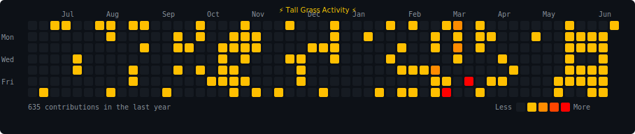

<div align="center">

<!-- Name with Pokeballs -->
&nbsp;&nbsp;
<a href="https://git.io/typing-svg"></a>
&nbsp;&nbsp;

<!-- Animated Tagline -->
<a href="https://git.io/typing-svg"></a>

<!-- Main Typing Intro -->
<a href="https://git.io/typing-svg"></a>
<!-- Animated Character + Codex walking -->


---

<!-- TRAINER CARD Section Header -->
<a href="https://git.io/typing-svg"></a>

<table>
<tr>
<td align="center">

```
╔══════════════════════════════════╗
║       ⚡ TRAINER CARD ⚡           ║
╠══════════════════════════════════╣
║                                  ║
║  Name:    Akshit Gaur            ║
║  Class:   AI Engineer            ║
║                                  ║
║  TYPE:    Python / JavaScript    ║
║                                  ║
║  SPECIAL ABILITY:                ║
║  "Engineering AI Systems that    ║
║       Benefit Humanity"          ║
║                                  ║
║  STATUS:  Building 30 Agents     ║
║           in 30 Days             ║
║                                  ║
╚══════════════════════════════════╝
```

</td>
</tr>
</table>

---

<!-- BATTLE STATS Section Header -->
<a href="https://git.io/typing-svg"></a>

<table>
<tr>
<td align="center">

```
┌─────────────────────────────┐
│       ⚡ MOVE SET ⚡          │
├─────────────────────────────┤
│                             │
│  🐍 Python ████████████ 99  │
│  🤖 AI/ML  ████████████ 99  │
│  🔗 MCP    ████████████ 99  │
│  📦 JS     ████████████ 99  │
│  🧱 LLMs   ████████████ 99  │
│  🔍 RAG    ████████████ 99  │
│                             │
└─────────────────────────────┘
```

</td>
</tr>
</table>

---

<!-- ITEMS IN BAG Section Header -->
<a href="https://git.io/typing-svg"></a>

<br/>


<br/><br/>

<!-- Contribution Grid (amber → red) -->


---

<!-- Footer -->
<br/>


</div>
